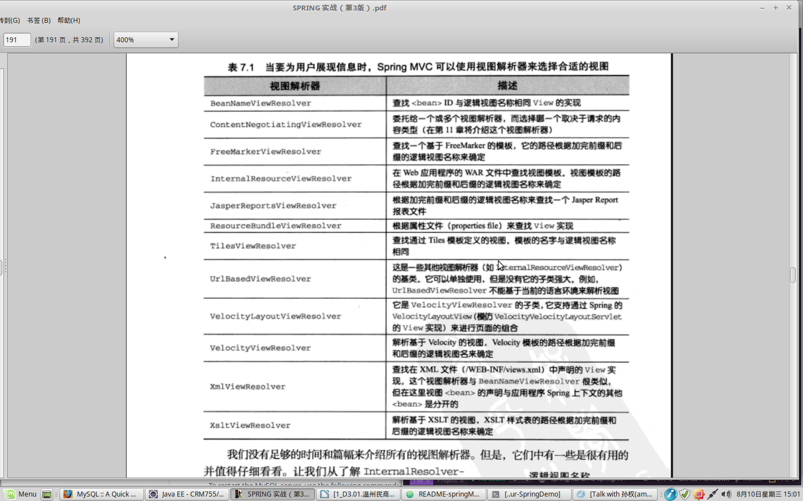

## Spring MVC

### 配置 DispatcherServlet
> 修改 web.xml 文件，添加以下内容：

```
	<servlet>
	 <servlet-name>Dispatcher</servlet-name>
	 <servlet-class>org.springframework.web.servlet.DispatcherServlet</servlet-class>
	 <load-on-startup>1</load-on-startup>
	</servlet>

	<servlet-mapping>
	 <servlet-name>Dispatcher</servlet-name>
	 <url-pattern>/</url-pattern>
	</servlet-mapping>
```
>	添加 SpringMVC 的Dispatcher的默认配置文件 Dispatcher-servlet.xml 【与web.xml同目录，名称为上面所取的<servlet-name>-serlet.xml】

### 静态资源
> Spring 的MVC命名空间包含了一个新的<mvc:resources> 元素，他会处理静态资源的请求。
```
	<mvc:resources mapping="/resources/**" location="/resources/" />
```

### 注解驱动特性
> 在<servlet-name>-serlet.xml中添加一行配置就能得到Spring所提供的注解特性：
```
	<mvc:annotation-driven />
```

### 视图解析器

* InternalResourceViewResolver : Spring MVC中大量使用约定优于配置的开发模式。InternalResourceViewResolver就是一个面向约定的元素。它将逻辑视图名解析为View对象，该对象将渲染的任务委托给Web应用程序上下文的一个模板（通常是JSP）。通过为逻辑视图名添加前缀和后缀来确定Web应用程序中模板的路径。简单的将请求床递给要渲染的JSP。
```
	<bean class="org.springframework.web.servlet.view.InternalResourceViewResolver">
		<property name="prefix" value="/WEB-INF/views/" />
		<property name="suffix" value=".jsp" />
	</bean>
```
> 若是使用 JSTL 标签,则需要设置viewClass属性来将InternalResourceView替换成JstlView
```
	<bean class="org.springframework.web.servlet.view.InternalResourceViewResolver">
		<property name="viewClass" value="org.springframework.web.servlet.view.JstlView"
		<property name="prefix" value="/WEB-INF/views/" />
		<property name="suffix" value=".jsp" />
	</bean>
```
> JstlView将请求传递给JSP，就像InternalResourceView一样。但它会公布特定的JSTL的请求属性，这样就可以使用JSTL的国际化支持了。
* Apache Tiles 布局管理器：一个模板框架，将页面分成片段并在运行时组装成完整的页面。使用Tiles，首先在<servlet-name>-serlet.xml中将其注册成为一个<bean>:
```
	<bean class="org.springframework.web.servlet.view.tiles.TilesViewResolver" />
```
> 这个声明会建立一个视图解析器，他会查找逻辑视图名称与Tiles定义名称相同的Tiles模板定义，并将其作为视图。Spring是如何知道Tiles定义的，TilesViewResolver本身并不了解Tiles定义的任何事，而是依靠TilesConfigurer来记录这个信息。
```
	<bean class="org.springframework.web.servlet.view.tiles2.TilesConfigurer">
		<property name="definitions">
			<list>
				<vale>/WEB-INF/views/**/views.xml</vale>
			</list>
		</property>
```
> TilesConfigurer会加载一个或多个Tiles定义，并使得TilesViewResolver可以通过它来解析视图。<br />
Tiles 定义
```
	<!DOCTYPE tiles-definitions PUBLIC
		"-//Apache Software Foundation//DTD Tiles Configuration 2.1//EN"
		"http://tiles.apache.org/dtds/tiles-config_2_1.dtd">
	<tiles-definitions>
		<definition name="template" template="/WEB-INF/views/main_template.jsp">
			<put-attribute name="top" value="/WEB-INF/views/tiles/sampleForm.jsp" />
			<put-attribute name="side" value="/WEB-INF/views/tiles/signinsignup.jsp" />
		</definition>
		<definition name="home" extends="template">
			<put-attribute name="content" value="/WEB-INF/views/home.jsp" />
		</definition>
	</tiles-definitions>
```
home.jsp
```
	<%@ taglib prefix="c" uri="jstl" %>
	<%@ taglib prefix="s" uri="spring-tags" %>
	<%@ taglib prefix="t" uri="jstl" %>
	<%@ taglib prefix="fmt" uri="jstl" %>
	<div>
		<ol class="sample-list">
			<c:forEach value="sample" items="${samples}">
				<s:url value="/samples/{sampleName}" var="sample_url">
					<s:param name="sampleName" value="${sample.sampler.username}" />
				<s:url>
				<span class="sampleListText">
					<a href="${sample_url}">
						<c:out value="${sample.sampler.username}" /></a>
						- <c:out value="${sample.text}" /><br />
						<fmt:formatDate value="{$sample.when}" pattern="hh:mma MMM d, yyyy" />
				</span>
			</c:forEach>
		</ol>
	</div>
```
Spring 的 <s:url> 和 JSTL 的 <c:url> 很相似，主要区别为<s:url>支持参数化的URL路径。

### _ContextLoaderListener_ Servlet监听器
我们必须告诉ContextLoaderListener需要加载哪些配置文件。如果没有指定，上下文加载器会查找/WEB-INF/applicationContext.xml这个Spring配置文件。但是这个文件并没有将应用根据分层进行拆分。我们需要重写默认实现：
```
	<context-param>
	   <param-name>contextConfigLocation</param-name>
	   <param-value>
		 	/WEB-INF/xxx-security.xml
			classpath:service-context.xml
			classpath:persistence-context.xml
			classpath:dataSource-context.xml
		 </param-value>
	</context-param>

	<listener>
	   <listener-class>
	      org.springframework.web.context.ContextLoaderListener
	   </listener-class>
	</listener>
```
contextConfigLocation参数指定了一个路径列表。除特殊说明，路径是相对于应用程序根目录的。classpath:前缀使得这些XML文件能够以资源的方式在应用程序中的类路径中加载，而其他文件则添加了Web应用程序的本地路径。

### 控制器
```
	@Controller
	@RequestMapping("/sample")
	public class SampleController {
		public final SampleService sampleService;
		@Inject
		public SampleController(SampleService sampleService) {
			this.sampleService = sampleService;
		}
		@RequestMapping(value="/samples", method=GET)
		public String listSamplesForSampler(@RequestParam("sampler") String username, Moel model) {
			Sampler sampler = sampleService.getSampler(username);
			model.addAttribute(sampler);
			model.addAttribute(sampleService.getSamplesForSampler(username));
			return "samples/list";
		}
	}
```
@Controller 注解告知<context:component-scan>该类应该被自动发现并作为一个Bean注册到Spring应用上下文。@RequestMapping：类级别的情况定义了这个控制器所处理的根URL路径；方法级别的则限制或缩小了类级别所定义的路径匹配。_@RequestParam("sampler")_ 表明了它的值应该根据请求中名为sampler的查询参数来获取。基于约定，如果方法的参数没有使用注解的话，将绑定到同名的查询参数上，如果上面的方法的参数名为 sampler，则可省略此注解。最好是使用。<br />
Tiles 定义
```
	<!DOCTYPE tiles-definitions PUBLIC
		"-//Apache Software Foundation//DTD Tiles Configuration 2.1//EN"
		"http://tiles.apache.org/dtds/tiles-config_2_1.dtd">
	<tiles-definitions>
		<definition name="samples/list" extends="template">
			<put-attribute name="content" value="/WEB-INF/views/samples/list.jsp" />
		</definition>
	</tiles-definitions>
```
list.jsp
```
	<%@ taglib prefix="c" uri="jstl" %>
	<%@ taglib prefix="s" uri="spring-tags" %>
	<div>
		<table cellspacing="15">
			<c:forEach items="${sampleList}" var="sample">
				<tr>
					<td>
						
					</td>
					<td>
						<a href="<s:url value='/samples/${sample.sampler.username}' />">${sample.sampler.username}</a>
						<c:out value="${sample.text}" /><br />
						<c:out value="${sample.when}" />
					</td>
				</tr>
			</c:forEach>
		</table>
	</div>
```
