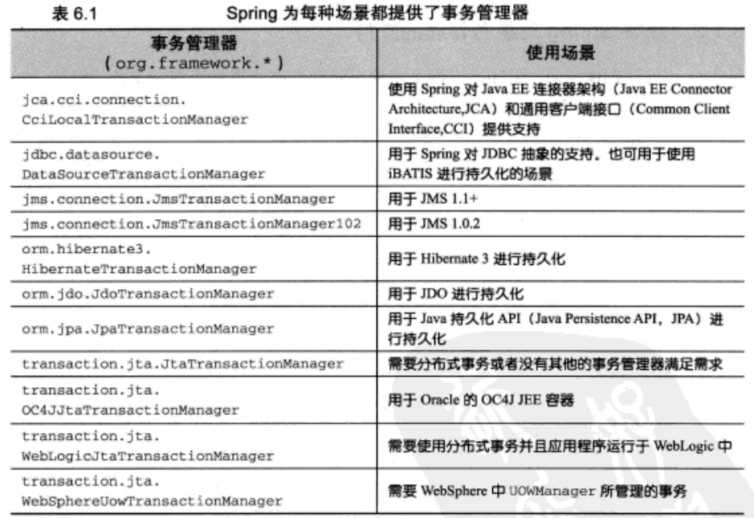
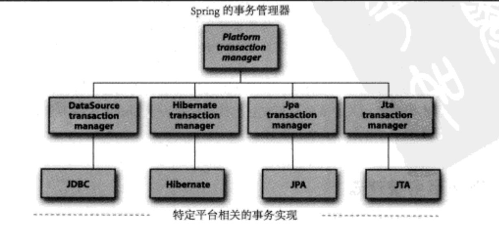

## Transaction
> 全有或全无的操作？事务允许你将几个操作组合成一个要么全部发生要么全部不发生的工作单元。事务确保了数据或资源免于处在不一致的状态中。
 人们用一个术语（ _ACID_ ）来描述事务：
  * Atomicty (原子性)不可部分完成性。一个事务就是一个运行单元，其结果只有运行成功（全部发生）或是失败（全部不发生）。
  * Consistency 一致性。
  * Isolation 隔离性。允许多个用户对相同的数据进行操作，每个用户的操作不会与其他用户纠缠在一起。
  * Durability 持久性。一旦事务完成，事务的结果应该持久化。，这样就能从任何的系统崩溃中恢复过来。

### Spring对事务的支持
> Spring通过回调机制将实际的事务实现从事务性的代码中抽象出来。如果你的应用程序只是用一种持久化资源，Spring可以使用持久化机制本身所提供的事务性支持，这包括了JDBC、Hibernate以及Java持久化API（Java Persistence API，JTA）。但是如果应用程序的事务将跨多个资源，那么Spring会使用第三方的JTA实现来支持分布式（XA）事务。

## 局部事务 VS 全局事务

## 编程式事务 与 申明式事物
> 选择编程式事务还是声明式事务很大程度上是在 _细粒控制_ 和 _易用性_ 之间进行权衡。

### 编程式事务
> 在源代码中编码实现对事务的管理。精确控制事务的边界，它们的开始和结束完全取决于你的需求。

1. 使用使用  PlatformTransactionManager 直接实现事务
2. 开始一个新事务，需要一个有合适属性的 TransactionDefinition 实例
3. 通过 TransactionDefinition 实例的 getTransaction() 方法获得
4. 使用 commit() 方法提交事务
5. 使用 rollback() 方法回滚事务

### 申明式事务
> 申明式事务允许你将事务管理从业务代码中独立出来，使用注解和xml配置文件来管理事务

- 使用 <tx:advice /> 标签创建一个事务处理的 advice

## 事务管理器
> Spring不直接管理事务，它提供了多种事务管理器，它们将事务管理的职责委托给JTA或其他持久化机制所提供的平台相关的事务实现。

